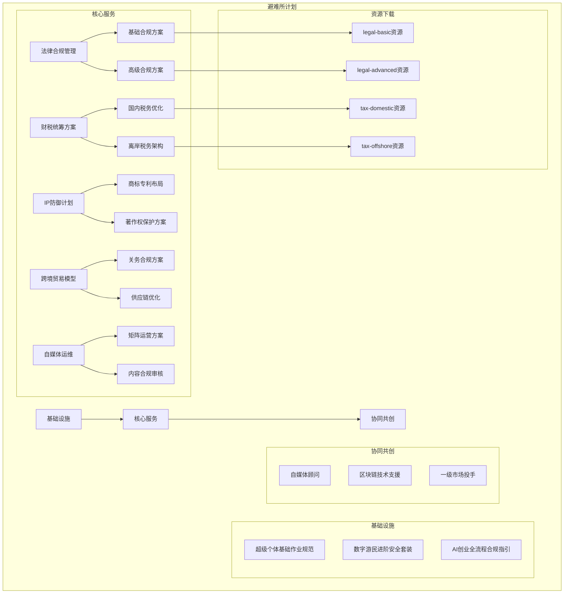

# 避难所计划服务方案逻辑关系分析

## 项目概览

避难所计划是一个为超级个体打造的服务生态系统，包含三大核心板块：基础设施、核心服务和协同共创。本分析详细梳理了各板块之间的逻辑关系和具体服务内容。

---

## 服务体系架构

```
┌─────────────────────────────────────────────────────────────┐
│                      避难所计划                             │
├─────────────┬─────────────┬─────────────────────────────────┤
│ 基础设施    │ 核心服务    │ 协同共创                         │
│ (数字基座)  │ (业务服务)  │ (生态网络)                       │
├─────────────┼─────────────┼─────────────────────────────────┤
│ 基础规范    │ 法律合规    │ 自媒体顾问                       │
│ 安全套装    │ 财税统筹    │ 区块链技术支援                   │
│ AI合规指引  │ IP防御      │ 一级市场投手                     │
│             │ 跨境贸易    │                                 │
│             │ 自媒体运维  │                                 │
└─────────────┴─────────────┴─────────────────────────────────┘
```

---

## 一、基础设施板块

### 板块定位
**为超级个体打造的数字基座**，提供基础作业规范和安全保障。

### 服务方案列表

| 方案名称 | 适用场景 | 服务内容 |
|---------|---------|----------|
| **超级个体基础作业规范** | 适用于刚开始独立运营的个体 | - 个人信息去标记化SOP<br>- 高强度密码管理方案<br>- 基础硬件防火墙配置 |
| **数字游民进阶安全套装** | 全球移动办公场景 | 硬件防火墙方案与加密通讯指引 |
| **AI创业全流程合规指引** | AIGC相关创业项目 | 数据出境、算法备案及伦理审查自查表 |

### 联系与订阅
- 订阅方式：扫描二维码联系
- 联系渠道：通过 `/assets/qr_contact.png` 二维码

---

## 二、核心服务板块

### 板块定位
**确保每一分利润都在阳光下合法避险**，提供专业的业务服务方案。

### 服务方案详情

#### 1. 法律合规管理
**业务涉及多法域或敏感行业**，提供合同审查、股权架构设计与争议解决前置方案。

| 子方案 | 适用场景 | 服务内容 | 资源组 |
|-------|---------|----------|--------|
| **基础合规方案** | 初创企业基础法律合规 | 包含合同模板库、基础股权架构设计和年度法律健康检查 | legal-basic |
| **高级合规方案** | 跨国业务复杂法律架构 | 多法域合规架构、跨境交易审查、争议解决预案 | legal-advanced |

#### 2. 财税统筹方案
**从记账报税到资金流转的全链路优化**，利用税收协定与离岸架构进行合法税务筹划。

| 子方案 | 适用场景 | 服务内容 | 资源组 |
|-------|---------|----------|--------|
| **国内税务优化** | 个人所得税优化 | 利用税收优惠政策，合法降低税负 | tax-domestic |
| **离岸税务架构** | 跨境资产配置 | 离岸公司设立、税收协定利用、全球税务合规 | tax-offshore |

#### 3. IP防御计划
**知识产权布局与侵权风险防控体系**，提供商标、专利、著作权全方位保护策略。

| 子方案 | 适用场景 | 服务内容 | 资源组 |
|-------|---------|----------|--------|
| **商标专利布局** | 品牌与技术创新保护 | 国内外商标注册、专利申请与维权策略 | ip-trademark |
| **著作权保护方案** | 内容创作者版权保护 | 作品登记、侵权监测与维权执行 | ip-copyright |

#### 4. 跨境贸易模型
**跨境电商与海外业务拓展**，提供关务合规、外汇管理与供应链优化方案。

| 子方案 | 适用场景 | 服务内容 | 资源组 |
|-------|---------|----------|--------|
| **关务合规方案** | 进出口业务合规 | 商品归类、原产地规划与关税优化 | trade-compliance |
| **供应链优化** | 跨境物流与仓储 | 海外仓布局、物流渠道优化与库存管理 | trade-supply-chain |

#### 5. 自媒体运维
**内容创作者与MCN机构**，提供多平台账号矩阵管理与内容合规审核。

| 子方案 | 适用场景 | 服务内容 | 资源组 |
|-------|---------|----------|--------|
| **矩阵运营方案** | 多平台内容分发 | 账号矩阵搭建、内容同步与数据分析 | media-matrix |
| **内容合规审核** | 平台规则与广告法合规 | 敏感词检测、广告合规审查与风险预警 | media-compliance |

---

## 三、协同共创板块

### 板块定位
**连接资源与机会的生态网络**，为超级个体提供专业顾问服务。

### 服务方案列表

| 方案名称 | 适用场景 | 服务内容 | 专家团队 |
|---------|---------|----------|----------|
| **自媒体顾问** | 内容创作者成长路径规划 | 平台算法解读与爆款内容策略指导 | 张媒体 (资深自媒体策略顾问) |
| **区块链技术支援** | Web3项目开发与链上数据分析 | 智能合约审计与DeFi协议安全评估 | 李链上 (区块链安全研究员) |
| **一级市场投手** | 早期项目投资与股权配置 | 项目尽调方法论与估值模型构建 | 王投手 (早期投资合伙人) |

---

## 四、下载资源关联

### 核心服务资源包

| 资源组ID | 关联服务方案 | 包含文件 |
|---------|-------------|----------|
| **legal-basic** | 法律合规管理 - 基础合规方案 | - 标准合同模板库 (12MB, zip)<br>- 股权架构设计指南 (3.5MB, pdf) |
| **legal-advanced** | 法律合规管理 - 高级合规方案 | - 跨境交易审查手册 (8.2MB, pdf)<br>- 争议解决预案模板 (5.1MB, zip) |
| **tax-domestic** | 财税统筹方案 - 国内税务优化 | - 个人所得税优化指南 (4.8MB, pdf)<br>- 税务计算工具表 (1.2MB, xlsx) |
| **tax-offshore** | 财税统筹方案 - 离岸税务架构 | - 离岸架构设计手册 (6.5MB, pdf)<br>- 税收协定汇编 (9.1MB, pdf) |

---

## 五、服务访问流程

### 1. 基础设施服务
- **访问方式**：扫描二维码联系
- **服务流程**：
  1. 浏览基础设施服务列表
  2. 点击感兴趣的服务
  3. 扫描弹出的二维码联系客服
  4. 完成订阅流程

### 2. 核心服务
- **访问方式**：兑换码验证
- **服务流程**：
  1. 浏览核心服务列表
  2. 选择具体服务方案
  3. 输入兑换码验证身份
  4. 验证成功后下载相关资源

### 3. 协同共创
- **访问方式**：专家直接联系
- **服务流程**：
  1. 浏览专家团队列表
  2. 查看专家详细信息
  3. 通过提供的邮箱直接联系专家

---

## 六、业务逻辑关系图



---

## 七、服务体系优势

1. **全链路覆盖**：从基础规范到专业服务再到资源对接，形成完整的服务生态
2. **分级服务**：针对不同需求层次提供基础版和高级版服务
3. **资源配套**：核心服务均配备专业资源包，提升服务价值
4. **专家支持**：协同共创板块提供一对一专家咨询服务
5. **合规保障**：所有服务方案均强调合规性，降低法律风险

---

## 八、应用场景分析

| 用户类型 | 推荐服务路径 | 预期收益 |
|---------|-------------|----------|
| **初创个体** | 基础设施 → 核心服务基础方案 → 协同共创 | 建立基础规范，获得专业指导 |
| **成熟个体** | 核心服务高级方案 → 协同共创 | 优化业务流程，拓展资源网络 |
| **创业团队** | 基础设施 + 核心服务全套 → 协同共创 | 全方位保障，快速成长 |

---

*本分析基于项目当前数据结构，服务内容可能会根据实际需求进行调整和扩展。*

*生成时间：2026-02-25*
